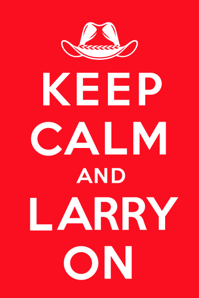
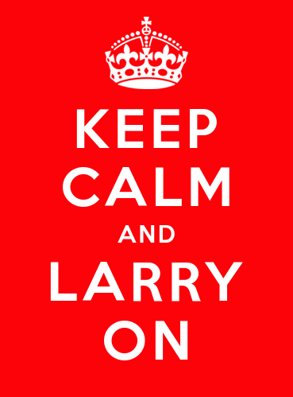

# KEEP CALM AND LARRY ON



I designed this for the [London Perl & Raku Workshop 2026](http://act.yapc.eu/lpw2026/).
I hope they'll like it enough to produce it!

## The original discussion and inspiration

On 2026-08-19 (Europe/Paris time):

```
#p5p (irc.perl.org)
01:30 <@ether> is rleach on irc? I cannot remember his handle
01:30 <@ether> if he is -- commit b54e6f55f4 is awesome and I think worthy of a delta entry
01:31 <@ether> ah yes, hydahy!  ^^
01:32 <@ether> ...and there is one, in the very next commit. never mind! carry on! ;D
01:32 <TonyC> no caffiene yet, misread "Larry on"
01:36 <@ether> :)
...
23:05 <mohawk_ic> TonyC: "keep calm and larry on"
23:05 <mohawk_ic> (possibly from too much caffeine)
...
23:54 <BooK> mohawk_ic: ❤️
23:55 <BooK> this need to be a T-shirt. With just the text and a mustache somewhere
...
00:47 <mohawk_ic> make the moustache replace the crown in the original poster
01:48 <BooK> love it!
01:49 <BooK> or maybe swap the crown with his Australian hat
01:53 <BooK> or course, for Pearl, "keep clam and carry on" would work too
01:54 <BooK> something like this https://share.bruhat.net/KEEP_CALM_AND_LARRY_ON.png
01:55 <BooK> if there's a London Perl Workshop, they *have* to have that on a T-shirt. And send me a pink version of it.
02:25 <BooK> needless to say, I'm already working on the SVG file...
02:30 <mohawk_ic> well i was going to sell it myself and make millions
02:52 <BooK> I'll give you the SVG for 50% of the profits
```

## The first draft

Generated with <https://fontmeme.com/keep-calm/>.



This wasn't good enough for me, obviously.

## Polishing the design

During the IRC conversation, I spent frantic 40 minutes
(between 1:50 and 2:36 my time), with the 
[original scan picture from Wikipedia](https://en.wikipedia.org/wiki/Keep_Calm_and_Carry_On#/media/File:Keep-calm-and-carry-on-scan.jpg),
the [KeepCalm font](https://fontmeme.com/keep-calm/),
a [picture of Larry with his outback hat](https://opensource.com/sites/default/files/images/life-uploads/image_larry_wall.jpg)
(obtained from [this article](https://opensource.com/article/17/10/perl-turns-30)),
and [ChatGPT](https://chatgpt.com/).

I first used the scan of the original poster (read all about it on
[Wikipedia](https://en.wikipedia.org/wiki/Keep_Calm_and_Carry_On)) to
decide of the image proportions, and overlap the scanned letters with
the ones from the font. I positioned every letter individually, going
back and forth with the scan to make sure they were correctly positioned.
(Don't tell me I'm a perfectionist, I know too well!)

Then after figuring out a mustache wouldn't look great in place of the crown
(and a hat would keep it closer to the original), I enlisted ChatGPT to 
produce a version of Larry's outback hat in the same style as the
crown on the original posted. 

(I kept a copy of the AI session).

Later, on 2026-10-04, I asked ChatGPT to remove the buttons on the side
of the hat, because I couldn't see them on any of the photos of Larry
with his hat, and they annoyed me.

# Get the final SVG

* [keep_calm_and_larry_on-work.svg](keep_calm_and_larry_on-work.svg)
  (working document: needs the KeepCalm font installed, embeds the original scan)
* [keep_calm_and_larry_on.svg](keep_calm_and_larry_on.svg)
  (all letters are paths, no font needed)

